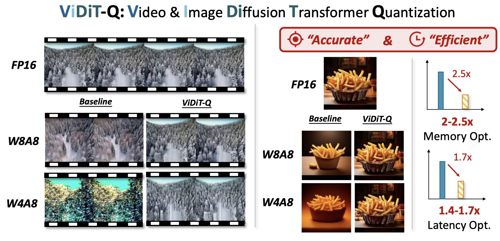
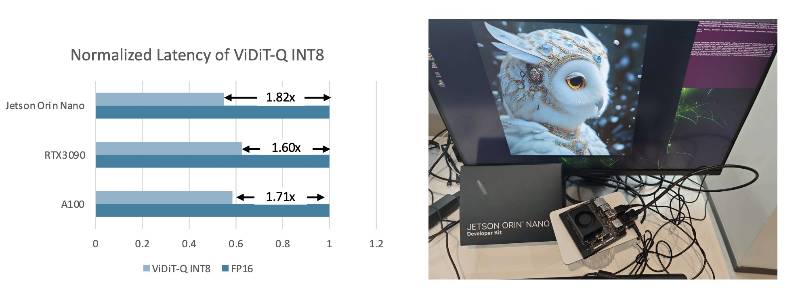

<div align="center">
<h1>  [ICLR'25] ViDiT-Q: Efficient and Accurate Quantization of Diffusion Transformers for Image and Video Generation</h1>  

<a href="https://arxiv.org/abs/2406.02540">
  
</a>
<a href="https://a-suozhang.xyz/viditq.github.io/">
    
</a>
</div>

This repo contains the official code of our ICLR'25 paper: [ViDiT-Q: Efficient and Accurate Quantization of Diffusion Transformers for Image and Video Generation](https://arxiv.org/abs/2406.02540).

### News

- [25/01] We release the cuda kernel, and end2end accelerated pipeline for opensora v1.2 and pixart-sigma. for more details, please ref the [./kernels/readme.md](./kernels/readme.md)
- [25/01] We updated and reorganize the code for ViDiT-Q, with improved file organization, the quantization related code are collected into a standalone python package `quant_utils`, which is easier applicable to new models. 
- [25/01] ViDiT-Q is accepted by ICLR'25.
- [24/07] We release the ViDiT-Q algorithm-level quantization simulation code at [https://github.com/thu-nics/ViDiT-Q](https://github.com/thu-nics/ViDiT-Q), now we have updated the code, and the deprecated older version could be accessed from the branch `viditq_old`.

---

We introduce ViDiT-Q, a quantization method specialized for diffusion transformers. For popular large-scale models (e.g., open-sora, Latte, Pixart-α, Pixart-Σ) for the video and image generation task, ViDiT-Q could achieve W8A8 quantization without metric degradation, and W4A8 without notable visual quality degradation.

[]()

### Performance and Efficiency

|FP16|ViDiT-Q W4A8 Mixed Precision|
|---|---|
|[]()|[]()|
|[]()|[]()|
|[]()|[]()|

|FP16|ViDiT-Q W4A8 Mixed Precision|ViDiT-Q W4A4 Mixed Precision|
|---|---|---|
|[]()|[]()|[]()|
|[]()|[]()|[]()|
|[]()|[]()|[]()|

---

With our [implemented CUDA kernels](./kernels/README.md), the ViDiT-Q quantization could achieve practical resource savings on various GPU plarforms. 

[]()

For more examples, please refer to our [Project Page: https://a-suozhang.xyz/viditq.github.io/](https://a-suozhang.xyz/viditq.github.io/)


### Usage

We pack the quantization (including viditq methodology as a special case) related code into a standalone python package (located in `quant_utils` folder). It could be easily adapted to existing codebase, by customize a `quant_model` class inherit from the orginal model class deinition. The `examples/` folder contains the example of applying viditq to diffuser's piplines (pixart-sigma), and normal code repository (opensora). PRs are welcomed for more model support. We also provide examples for image generation DiT, and Flux model (not fully supported all vidtq techniques). 

# Env Setup

We recommend using conda for enviornment management. For each model in the examples folder, you could refer to the orginal codebase's readme for environment setup, we recommend using independent environment for different models since they may contain conflict package versions. 

Then, for each environment, for the support of quantization **software simulation**, you could install the `qdiff` package by locally install the package in the `./quant_utils` folder. (the `-e` is for editable installation, in case you want to modify the quantization related code.)

```
cd ./quant_utils
pip install -e .
```

Optionally, for inference with **hardware cuda kernel** for practical resource savings. Please install the `viditq_extension` package by locally install the package in the `./kernels` folder 

```
cd ./kernels
pip install -e .
```

<br>


# Example: 🎬 video generation (OpenSORA v1.2)

### Setup

1. clone the OpenSORA codebase as a submodule into `./examples/opensora1.2/` (the opensora codebase need to be slightly modified to support precompute text embeds, so we include the opensora codebase here.)

2. setup the environment following `./examples/opensora1.2/OpenSORA/README.md`

3. modify the file path for checkpoints in `./examples/opensora1.2/OpenSORA/configs`

### 0.0 (optional) Precompute Text Embeds

Due to the T5 text embedder is large, and need to be loaded into GPU memory. For memory constrained scenarios (e.g., RTX3090, 24GB), we support precompute the text embeddings, and save it offline to avoid loading the T5 on GPU. 

For OpenSORA codebase, the scheduler code need to be modified as follows. (we provide the modified one in [./examples/opensora1.2/Open-Sora/opensora/schedulers/rf/__init__.py](examples/opensora1.2/Open-Sora/opensora/schedulers/rf/__init__.py), which is the only modification made to the original opensora codebase.)

- `RF/__init__.py`: `precompute_text_embeds=False` as sample() input attribute

```         
# INFO: save the text embeds to avoid save text_encoder
save_d = {}
save_d['model_args'] = model_args
torch.save(save_d, './precomputed_text_embeds.pth')
```

To configure whether to use "precompute_text_embeds", add `precompute_text_embeds = False` in the opensora `*.py` config file (example: [examples/opensora1.2/configs/software_simulation.py](./examples/opensora1.2/configs/software_simulation.py))

### 0.1. FP16 inference

Generate the videos with FP16 precision with prompts specifed with `--prompt_path`, the `configs/software_simulation.py` specifies the details for generation (e.g., resolution). The generated videos are saved in the `save_dir` path in the config. (The command line `--prompt_path` overwrites the ones in the config file.)

``` bash
python fp_inference.py configs/software_simulation.py \
  --prompt-path ./assets/prompts.txt
```

---

## 1. Quantization Process

We introduce an additional config.yaml to specify the quantization details. The opensora config file *.py's `ptq-config` attribute specifies which quant config to use. We provide 3 example for baseline and viditq quantization:

- [examples/opensora1.2/configs/config.yaml](examples/opensora1.2/configs/config.yaml)
- [examples/opensora1.2/configs/w8a8.yaml](examples/opensora1.2/configs/w8a8.yaml)
- [examples/opensora1.2/configs/w4a8_mixed_precision.yaml](examples/opensora1.2/configs/w4a8_mixed_precision.yaml). 

### 1.1 Generate calib data

Some quantization techniques (e.g., smooth quant) requires calibration of activation distribution. The calib data generatio process involves conducting FP16 inference, and save the activation into `calib_data.pth`. The calib data will be saved in the `calib_data` sprcified in the quant_config (the `ptq_config` file in opensora config). 

``` bash
python get_calib_data.py configs/software_simulation.py \
 --prompt-path ./assets/t2v_samples.txt
```

### 1.2 Post Training Quantization (PTQ) Process

The PTQ process generates the quant_params (scaling factor and zero point in FP16 format) in the `save_dir`. 
The quantization related configurations (e.g., bitwidth) could be modified in the yaml foramted quant config. 

``` bash
python ptq.py configs/software_simulation.py --save-dir "./logs/w4a8_mp" 
```

### 1.3 Quantized Model Inference

The quant_inference process reads the ptq generated quant params, and conduct software simulation of quantization inference (the process is still in FP16, and could take longer time than FP16 inference). It will generate videos in `save_dir`. 

``` bash
python quant_inference.py configs/software_simulation.py --save-dir "./logs/w4a8_mp" 
```

### 1.4 Quantized Model Inference with CUDA Kernel

When the `hardware` flag is set to True in the opensora config. The quant inference are adopted with cuda kernel to achieve "real" quantized inference. It reads the ptq generated quant params, and export the converted integer weights `int_weight.pt` with reduced size, and generate videos with cuda kernels in the `viditq_extention` package. Please be noted that

``` bash
python quant_inference.py configs/cuda_kernel.py --save-dir "./logs/cuda_kernel_test" 
```


### 1.5 Mixed Precision Support

Noted that the mixed precision quantization is supported by simply modifying the config. Specify the opensora config with quant config [./examples/opensora1.2/configs/w4a8_mixed_precision.yamls](examples/opensora1.2/configs/w4a8_mixed_precision.yaml). Run both the ptq and the quant_infer process. 

``` bash
python ptq.py configs/software_simulation.py --save-dir "./logs/w8a8" 
python quant_inference.py configs/software_simulation.py --save-dir "./logs/w8a8" 
```

---


# Example: 🖼️ image generation (PixArt-sigma)

### Setup

1. install diffusers and download the pixart_sigma pipeline. (we provide example of locally save the pipeline in [examples/pixart/download_huggingface_model.py](examples/pixart/download_huggingface_model.py))


### 0.1 FP16 inference

Generate images in the `log` path (`precompute_text_embeds` is not supported but could be easily implemented).

```
python fp_inference.py --log "./logs/fp16"
```

## 1. Quantization Process

We provide 3 example for baseline and viditq quantization:

- [examples/opensora1.2/configs/config.yaml](examples/opensora1.2/configs/config.yaml). 
- [examples/opensora1.2/configs/w4a8_mixed_precision.yaml](examples/opensora1.2/configs/w4a8_mixed_precision.yaml). 
- [examples/pixart/configs/w4a8_mixed_precision.yaml](examples/pixart/configs/w4a8_mixed_precision.yaml)


### 1.1 Generate calib data

The calibration data are generated under the `log` folder.

``` bash
python get_calib_data.py --quant-config "./configs/${CFG}" --log "./logs/${LOG}"  --prompt $PROMPT_PATH
```

### 1.2 Post Training Quantization (PTQ) Process

- replace the `software_simulation.py` with `w4a8_mixed_precision.yaml` or `w4a8_mixed_precision.yaml`. 

``` bash
python ptq.py configs/software_simulation.py --save-dir "./logs/w4a8_mp" 
```

### 1.3 Quantized Model Inference

``` bash
python quant_inference.py --quant-config "./configs/${CFG}" --log "./logs/${LOG}" 
```

### 1.4 Quantized Model Inference with CUDA Kernel

``` bash
python quant_inference.py --quant-config "./configs/${CFG}" --log "./logs/${LOG}" --hardware
```

# Eval

- Please refer to the [eval/video/readme.md](eval/video/readme.md), [eval/image/readme.md](./eval/image/readme.md)

# Citation

If you find our work helpful, please consider citing:

```
@misc{zhao2024viditq,
      title={ViDiT-Q: Efficient and Accurate Quantization of Diffusion Transformers for Image and Video Generation}, 
      author={Tianchen Zhao and Tongcheng Fang and Enshu Liu and Wan Rui and Widyadewi Soedarmadji and Shiyao Li and Zinan Lin and Guohao Dai and Shengen Yan and Huazhong Yang and Xuefei Ning and Yu Wang},
      year={2024},
      eprint={2406.02540},
      archivePrefix={arXiv},
      primaryClass={cs.CV}
}
```

# Acknowledgments
Our code was developed based on [opensora v1.0](https://github.com/hpcaitech/Open-Sora)(Apache License), [PixArt-alpha](https://github.com/PixArt-alpha/PixArt-alpha)(AGPL-3.0 license), [PixArt-sigama](https://github.com/PixArt-alpha/PixArt-sigma)(AGPL-3.0 license) and [q-diffusion](https://github.com/Xiuyu-Li/q-diffusion)(MIT License)
